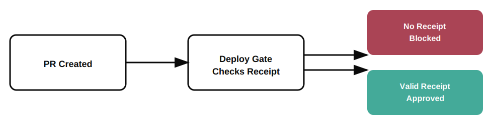

<p align="center">
  
</p>

<p align="center">
  <strong>No receipt. No merge.</strong>
</p>

<h1 align="center">Deploy Gate</h1>

<p align="center">
  <strong>One workflow. Human approval required. No exceptions.</strong>
</p>

<p align="center">
  <a href="https://github.com/permission-protocol/deploy-gate/actions">
    
  </a>
  <a href="https://github.com/marketplace/actions/deploy-gate">
    
  </a>
  
</p>

<p align="center">
  <a href="https://github.com/permission-protocol/deploy-gate/stargazers">
    
  </a>
  <a href="https://github.com/permission-protocol/deploy-gate/network/members">
    
  </a>
  
  
</p>

---

## Badge Usage

<p align="left">
  
  
</p>

<p align="left">
  
  
</p>

```markdown


```

---

## What It Does

**Blocks merges to `main` until a human approves.**

Any PR touching protected paths (default: `deploy/*`, `.github/workflows/*`) requires cryptographic approval before merge. No approval = CI fails = merge blocked.

---

## Install (3 minutes)

**👉 [Full install guide](./INSTALL.md)** with screenshots and troubleshooting.

**Quick version:**

```yaml
# .github/workflows/deploy-gate.yml
name: Deploy Gate

on:
  pull_request:
    branches: [main]

jobs:
  gate:
    runs-on: ubuntu-latest
    steps:
      - uses: actions/checkout@v4
      - uses: permission-protocol/deploy-gate@v1
        with:
          pp-api-key: ${{ secrets.PP_API_KEY }}
```

1. Get API key from [app.permissionprotocol.com](https://app.permissionprotocol.com)
2. Add secret: `gh secret set PP_API_KEY -b "pp_live_..."`
3. Add workflow above
4. Open PR → Watch it fail → Approve → Merge

---

## How It Works

<p align="left">
  
</p>

```
   PR opened → changes deploy/ or .github/workflows/
                        │
                        ▼
               ┌─────────────────┐
               │  Receipt exist? │
               └────────┬────────┘
                        │
          NO ───────────┴─────────── YES
          │                           │
          ▼                           ▼
   ┌──────────────┐           ┌──────────────┐
   │  ❌ CI FAILS │           │  ✅ MERGE OK │
   │              │           └──────────────┘
   │  Approval    │
   │  URL in logs │
   └──────┬───────┘
          │
          ▼
   Human approves in dashboard
          │
          ▼
   Re-run CI → ✅ Merge OK
```

---

## Advanced Setup

### 1. Get API Key

Sign up at [permissionprotocol.com](https://permissionprotocol.com) and create an API key.

### 2. Add Secret

```bash
gh secret set PP_API_KEY -b "pp_live_your_key_here"
```

### 3. Add Workflow

Create `.github/workflows/deploy-gate.yml`:

```yaml
name: Deploy Gate

on:
  pull_request:
    branches: [main]

jobs:
  gate:
    runs-on: ubuntu-latest
    steps:
      - uses: actions/checkout@v4
      - uses: permission-protocol/deploy-gate@v1
        with:
          pp-api-key: ${{ secrets.PP_API_KEY }}
```

### 4. Open a PR

Touch a protected path. Watch it fail. Approve. Merge.

---

## Configuration

| Input | Description | Default |
|-------|-------------|---------|
| `pp-api-key` | Your Permission Protocol API key | **Required** |
| `pp-base-url` | PP API base URL | `https://app.permissionprotocol.com` |
| `protected-paths` | Regex for protected paths | `^(deploy/\|\.github/workflows/)` |
| `fail-on-missing` | Fail if no receipt | `true` |

### Custom Protected Paths

```yaml
- uses: permission-protocol/deploy-gate@v1
  with:
    pp-api-key: ${{ secrets.PP_API_KEY }}
    protected-paths: '^(src/critical/|infra/|\.env)'
```

---

## Outputs

| Output | Description |
|--------|-------------|
| `approved` | `true` if approved, `false` otherwise |
| `request-id` | Deploy request ID (if created) |
| `approval-url` | URL to approve the deploy |

```yaml
- uses: permission-protocol/deploy-gate@v1
  id: gate
  with:
    pp-api-key: ${{ secrets.PP_API_KEY }}

- run: echo "Approval URL: ${{ steps.gate.outputs.approval-url }}"
  if: failure()
```

---

## Why?

Your AI agent just pushed to main.  
It passed CI.  
It deployed to production.

**Who approved it?**

Not a human. Not a policy. Nobody.

Deploy Gate closes that gap.

---

## Live Demo

See it in action: [permission-protocol/pp-demo](https://github.com/permission-protocol/pp-demo)

**🏆 [The Receipt Challenge](https://permissionprotocol.com/challenge)** — Try to merge without a receipt. If you succeed, you win.

---

<p align="center">
  <a href="https://permissionprotocol.com">
    
  </a>
</p>

<p align="center">
  <sub>Built by <a href="https://permissionprotocol.com">Permission Protocol</a> · The Signer of Record for Autonomous Systems</sub>
</p>
