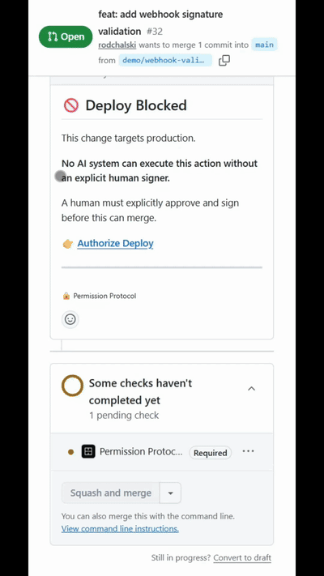

<p align="center">
  
</p>

<h1 align="center">Deploy Gate</h1>

<p align="center">
  <strong>Block AI deploys until a human signs.</strong>
</p>

<p align="center">
  AI agents can open PRs. They should not deploy to production.<br>
  This GitHub Action enforces that boundary.
</p>

<p align="center">
  <a href="https://github.com/permission-protocol/deploy-gate/actions">
    
  </a>
</p>

---

## See it in action

<p align="center">
  <a href="./assets/demo.mp4">
    
  </a>
</p>

```
PR opened → ❌ Deploy blocked → Human authorizes → ✅ Signed → Merge unlocked
```

---

## Quickstart

Add to your workflow:

```yaml
# .github/workflows/deploy-gate.yml
name: Deploy Gate

on:
  pull_request:
    branches: [main]

jobs:
  gate:
    runs-on: ubuntu-latest
    steps:
      - uses: actions/checkout@v4
      - uses: permission-protocol/deploy-gate@v2
        with:
          pp-api-key: ${{ secrets.PP_API_KEY }}
```

1. Get API key → https://app.permissionprotocol.com  
2. Add secret:
```bash
gh secret set PP_API_KEY -b "pp_live_..."
```
3. Open a PR → watch it get blocked → approve → merge

**Takes ~3 minutes. One secret.**

👉 [Full install guide →](./INSTALL.md)

---

## What it does

- Blocks risky PRs with a required status check  
- Posts a PR comment with a direct approval link  
- Sends the reviewer to Permission Protocol to approve and sign  
- Unblocks the PR instantly after approval  
- Produces a tamper-evident approval record  

---

## Why this exists

AI agents can write code, open PRs, and trigger workflows — but they should not have authority to deploy on their own.

Today:
- approvals are mutable
- logs are not proof
- systems trust state, not intent

Deploy Gate enforces:

- Explicit human signer (Ed25519)
- Signature bound to exact action (commit, repo, environment)
- Single-use receipt (replay fails)
- Tamper-evident — mutation invalidates approval

It does not trust database state. Only signed receipts.

---

## How it works

```
PR opened
   │
   ▼
Deploy Gate checks for valid receipt
   │
   ├── Receipt exists ───────────────► Merge allowed
   │
   └── No receipt ───────────────────► Blocked
                                          │
                                          ▼
                                   PR comment with approval link
                                          │
                                          ▼
                                   Human approves + signs
                                          │
                                          ▼
                                   Re-run CI → Merge allowed
```

---

## Try it live (30 seconds)

No install required:

1. Open demo PR  
   https://github.com/permission-protocol/pp-demo/pull/32  
2. Click Authorize Deploy  
3. Approve → see your signed receipt

---

## License

MIT — see LICENSE
