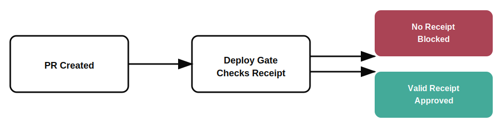

<p align="center">
  
</p>

<p align="center">
  <strong>No receipt. No merge.</strong>
</p>

<h1 align="center">Deploy Gate</h1>

<p align="center">
  <strong>Permission Protocol is the approval layer for autonomous systems. Deploy Gate is its GitHub Action.</strong>
</p>

<p align="center">
  <strong>One workflow. Human approval required. No exceptions.</strong>
</p>

<p align="center">
  <a href="https://github.com/permission-protocol/deploy-gate/actions">
    
  </a>
  <a href="https://github.com/marketplace/actions/deploy-gate">
    
  </a>
</p>

---

## Badge Usage

<p align="left">
  
  
</p>

<p align="left">
  
  
</p>

```markdown


```

---

## What It Does

**Blocks merges to `main` until a human approves.**

Every PR to a protected branch creates a Permission Protocol request. Approval state is enforced via commit status, and protected-path matches are sent as risk metadata (not used for gating).

---

## Install (3 minutes)

**👉 [Full install guide](./INSTALL.md)** with screenshots and troubleshooting.

**Quick version:**

```yaml
# .github/workflows/deploy-gate.yml
name: Deploy Gate

on:
  pull_request:
    branches: [main]

jobs:
  gate:
    runs-on: ubuntu-latest
    steps:
      - uses: actions/checkout@v4
      - uses: permission-protocol/deploy-gate@v1
        with:
          pp-api-key: ${{ secrets.PP_API_KEY }}
```

1. Get API key from [app.permissionprotocol.com](https://app.permissionprotocol.com)
2. Add secret: `gh secret set PP_API_KEY -b "pp_live_..."`
3. Add workflow above
4. Open PR → Permission request created automatically → approve if needed → merge

---

## How It Works

<p align="left">
  
</p>

```
   PR opened
      │
      ▼
   Deploy Gate verifies/creates PP request
      │
      ├─────────────── Auto-approved / verified ───────────────► ✅ Merge OK
      │
      └─────────────── Approval required ───────────────────────► ⏳ Pending status + PR comment with review link
                                                                    │
                                                                    ▼
                                                             Human approves in dashboard
                                                                    │
                                                                    ▼
                                                             Re-run CI → ✅ Merge OK
```

---

## Advanced Setup

### 1. Get API Key

Sign up at [app.permissionprotocol.com](https://app.permissionprotocol.com) and create an API key.

### 2. Add Secret

```bash
gh secret set PP_API_KEY -b "pp_live_your_key_here"
```

### 3. Add Workflow

Create `.github/workflows/deploy-gate.yml`:

```yaml
name: Deploy Gate

on:
  pull_request:
    branches: [main]

jobs:
  gate:
    runs-on: ubuntu-latest
    steps:
      - uses: actions/checkout@v4
      - uses: permission-protocol/deploy-gate@v1
        with:
          pp-api-key: ${{ secrets.PP_API_KEY }}
```

### 4. Open a PR

Open any PR to the protected branch. Deploy Gate always creates/verifies a request and posts a PR comment with the receipt/review link.

---

## ⚠️ Recommended: GitHub Ruleset Pattern

To avoid "merge loops" where approvals go stale when `main` advances, we recommend a **two-ruleset pattern** if you use GitHub Repository Rulesets:

1. **Ruleset 1 (Permission Protocol):** Require `Permission Protocol` status check with **Strict mode: OFF**.
2. **Ruleset 2 (Build Protection):** Require your build/test checks with **Strict mode: ON**.

This ensures your code is up-to-date with `main`, but your human approvals stick once granted. [See full guide →](./INSTALL.md#%EF%B8%8F-critical-github-rulesets--strict-mode)

---

## Configuration

| Input | Description | Default |
|-------|-------------|---------|
| `pp-api-key` | Your Permission Protocol API key | **Required** |
| `pp-base-url` | PP API base URL | `https://app.permissionprotocol.com` |
| `pp-request-create-token` | Optional token to auto-create approval requests when receipts are missing | `''` |
| `environment` | Environment bound to the receipt scope | `production` |
| `capability` | Capability bound to the receipt scope | `deploy:production` |
| `redeem` | Redeem receipt on verify (`false` for PR gate, `true` for deploy workflow) | `false` |
| `protected-paths` | Regex used for risk assessment metadata only (not gating) | `^(deploy/|\.github/workflows/)` |
| `fail-on-missing` | Fail if no receipt | `true` |
| `fail-open-timeout` | Seconds to wait before PP API fail-open | `30` |
| `post-comment` | Post/update PR comment with receipt or approval link | `true` |

### Risk Metadata Paths

```yaml
- uses: permission-protocol/deploy-gate@v1
  with:
    pp-api-key: ${{ secrets.PP_API_KEY }}
    protected-paths: '^(src/critical/|infra/|\.env)'
```
Protected path matches are forwarded to PP as `protectedPathsChanged` + `changedFiles` metadata for risk scoring.

## Advanced Usage

Use this when you want custom scope values and auto-request creation in one workflow.

```yaml
- uses: permission-protocol/deploy-gate@v1
  with:
    pp-api-key: ${{ secrets.PP_API_KEY }}
    pp-request-create-token: ${{ secrets.PP_REQUEST_CREATE_TOKEN }}
    environment: production
    capability: deploy:production
    redeem: false
    fail-on-missing: true
```

---

## Outputs

| Output | Description |
|--------|-------------|
| `approved` | `true` if approved, `false` otherwise |
| `receipt-id` | Receipt ID when a receipt is found |
| `decision` | Decision from receipt (`APPROVED`, `DENIED`, `PENDING`) |
| `error-code` | API error code when verification fails |
| `error-message` | API error message when verification fails |
| `request-id` | Deploy request ID (if created) |
| `approval-url` | URL to approve the deploy |

```yaml
- uses: permission-protocol/deploy-gate@v1
  id: gate
  with:
    pp-api-key: ${{ secrets.PP_API_KEY }}

- run: echo "Approval URL: ${{ steps.gate.outputs.approval-url }}"
  if: failure()
```

## PR Comment Example

Auto-approved / verified:
```markdown
✅ **Permission Protocol:** Approved
[View receipt →](https://app.permissionprotocol.com/pp/deploy-requests/{requestId})
```

Approval required:
```markdown
⏳ **Permission Protocol:** Approval required
[Review & approve →](https://app.permissionprotocol.com/pp/deploy-requests/{requestId})
```

---

## Why?

Your AI agent just pushed to main.  
It passed CI.  
It deployed to production.

**Who approved it?**

Not a human. Not a policy. Nobody.

Deploy Gate closes that gap.

---

## Live Demo

See it in action in the demo repo: [permission-protocol/pp-demo](https://github.com/permission-protocol/pp-demo)

---

## License

MIT. See [LICENSE](./LICENSE).

---

<p align="center">
  <a href="https://permissionprotocol.com">
    
  </a>
</p>

<p align="center">
  <sub>Built by <a href="https://permissionprotocol.com">Permission Protocol</a> · The Signer of Record for Autonomous Systems</sub>
</p>
