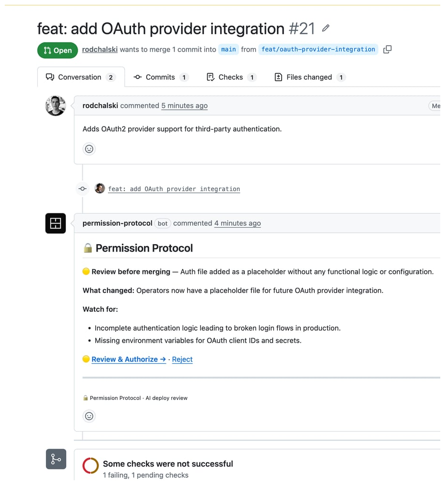

<p align="center">
  
</p>

<h1 align="center">Deploy Gate</h1>

<p align="center">
  <strong>AI tried to deploy. It got blocked.</strong>
</p>

<p align="center">
  No AI action executes without an explicit human signer.<br>
  One workflow. One secret. Works on your first PR.
</p>

<p align="center">
  <a href="https://github.com/permission-protocol/deploy-gate/actions">
    
  </a>
</p>

---

## How it works

```
PR opened → ❌ Deploy blocked → Human signs → ✅ Deploy proceeds
```

<p align="center">
  
</p>

Open a PR. Deploy Gate blocks the merge. Click the approval link. Sign. Merge proceeds. Receipt recorded.

**Takes ~3 minutes to install. One secret.**

---

## Install

```yaml
# .github/workflows/deploy-gate.yml
name: Deploy Gate

on:
  pull_request:
    branches: [main]

jobs:
  gate:
    runs-on: ubuntu-latest
    steps:
      - uses: actions/checkout@v4
      - uses: permission-protocol/deploy-gate@v1
        with:
          pp-api-key: ${{ secrets.PP_API_KEY }}
```

1. Get API key from [app.permissionprotocol.com](https://app.permissionprotocol.com)
2. Add secret: `gh secret set PP_API_KEY -b "pp_live_..."`
3. Add workflow above
4. Open a PR → see it blocked → approve → merge

**[Full install guide →](./INSTALL.md)**

---

## Why this exists

AI agents can deploy code, delete data, and modify infrastructure.

Today, they often do this with no approval, no accountability, and no audit trail. That's a production risk.

"Approved" is a mutable DB flag. An agent, a backend, or a bug can flip it. There's no proof a human authorized *this specific action* with *these exact arguments*.

Deploy Gate enforces:

- ✅ Explicit human signer (Ed25519)
- ✅ Signature bound to exact args (commit, repo, environment)
- ✅ Single-use receipt (replay fails)
- ✅ Tamper-evident — any post-signing mutation fails verification

It does not trust database state. Only the signed receipt.

---

## Flow

<p align="left">
  
</p>

```
   PR opened
      │
      ▼
   Deploy Gate verifies/creates request
      │
      ├── Receipt exists + valid ──────────────► ✅ Merge OK
      │
      └── No receipt ──────────────────────────► ⏳ Blocked + PR comment with approval link
                                                    │
                                                    ▼
                                               Human approves in dashboard
                                                    │
                                                    ▼
                                               Re-run CI → ✅ Merge OK
```

---

## PR Comments

Deploy Gate posts directly on your PR:

Approval required:
```
⏳ Permission Protocol: Approval required
   Review & approve → https://app.permissionprotocol.com/pp/deploy-requests/{id}
```

Approved:
```
✅ Permission Protocol: Approved
   View receipt → https://app.permissionprotocol.com/pp/deploy-requests/{id}
```

---

## Configuration

| Input | Description | Default |
|-------|-------------|---------|
| `pp-api-key` | Your Permission Protocol API key | **Required** |
| `pp-base-url` | PP API base URL | `https://app.permissionprotocol.com` |
| `environment` | Environment bound to the receipt scope | `production` |
| `capability` | Capability bound to the receipt scope | `deploy:production` |
| `redeem` | Redeem receipt on verify (`false` for PR gate, `true` for deploy workflow) | `false` |
| `fail-on-missing` | Fail if no receipt | `true` |
| `fail-open-timeout` | Seconds to wait before PP API fail-open | `30` |
| `post-comment` | Post/update PR comment with receipt or approval link | `true` |

<details>
<summary><strong>Advanced configuration</strong></summary>

| Input | Description | Default |
|-------|-------------|---------|
| `pp-request-create-token` | Optional token to auto-create approval requests | `''` |
| `protected-paths` | Regex for risk assessment metadata (not gating) | `^(deploy/\|\.github/workflows/)` |

### Risk Metadata Paths

```yaml
- uses: permission-protocol/deploy-gate@v1
  with:
    pp-api-key: ${{ secrets.PP_API_KEY }}
    protected-paths: '^(src/critical/|infra/|\.env)'
```

### Outputs

| Output | Description |
|--------|-------------|
| `approved` | `true` if approved, `false` otherwise |
| `receipt-id` | Receipt ID when a receipt is found |
| `decision` | Decision from receipt (`APPROVED`, `DENIED`, `PENDING`) |
| `error-code` | API error code when verification fails |
| `error-message` | API error message when verification fails |
| `request-id` | Deploy request ID (if created) |
| `approval-url` | URL to approve the deploy |

```yaml
- uses: permission-protocol/deploy-gate@v1
  id: gate
  with:
    pp-api-key: ${{ secrets.PP_API_KEY }}

- run: echo "Approval URL: ${{ steps.gate.outputs.approval-url }}"
  if: failure()
```

### GitHub Ruleset Pattern

To avoid "merge loops" where approvals go stale when `main` advances, use a **two-ruleset pattern**:

1. **Ruleset 1 (Permission Protocol):** Require `Permission Protocol` status check with **Strict mode: OFF**.
2. **Ruleset 2 (Build Protection):** Require your build/test checks with **Strict mode: ON**.

[See full guide →](./INSTALL.md#%EF%B8%8F-critical-github-rulesets--strict-mode)

</details>

---

## Live Demo

See it in action: [permission-protocol/pp-demo](https://github.com/permission-protocol/pp-demo)

---

## Badge Usage

<p align="left">
  
  
</p>

```markdown


```

---

## License

MIT. See [LICENSE](./LICENSE).

---

<p align="center">
  <a href="https://permissionprotocol.com">
    
  </a>
</p>

<p align="center">
  <sub>Built by <a href="https://permissionprotocol.com">Permission Protocol</a> · The Signer of Record for Autonomous Systems</sub>
</p>
